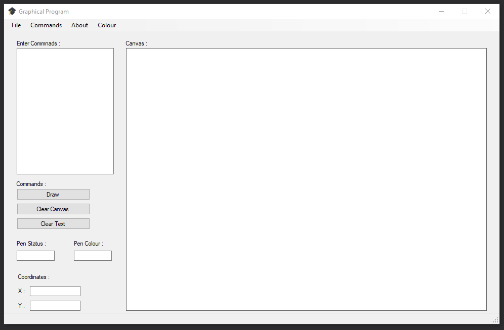

# Graphical Program - C#

This program is used to demonstrate examples of being able to teach simple programming concepts. The language that was used to build this project is C#, and the program will have the basics of sequence, selection, and iteration, which will allow a student programmer to explore these concepts using graphics. 

### Initial Tournament Dashboard 


## How to Use 

It's simple to get this program running on any Windows OS running Microsoft Visual Studio.

### What you'll need

```
Microsoft Visual Studio
```

```
Windows 10
```

### How to Run

```
Download the ZIP for this program
```

```
Open the ZIP Directory in Microsoft Visual Studio
```

```
Run the program
```

## Deployment

This will work on any live system running an up to date version of Windows and Microsoft Visual Studio.

## Built With

* [Microsoft Visual Studio](https://visualstudio.microsoft.com/) - The IDE used to build this program. 


## Authors

* **Brandon Parkinson** - *Program Development* - [Brandon Parkinson](https://github.com/brandonjamesparkinson)

## License

This project is licensed under the MIT License - see the [LICENSE.md](LICENSE.md) file for details

## Acknowledgments

* Hat tip to Udemy for providing fantastic tutorials on c#
* Shout out to my course mates for assistance throughout 
